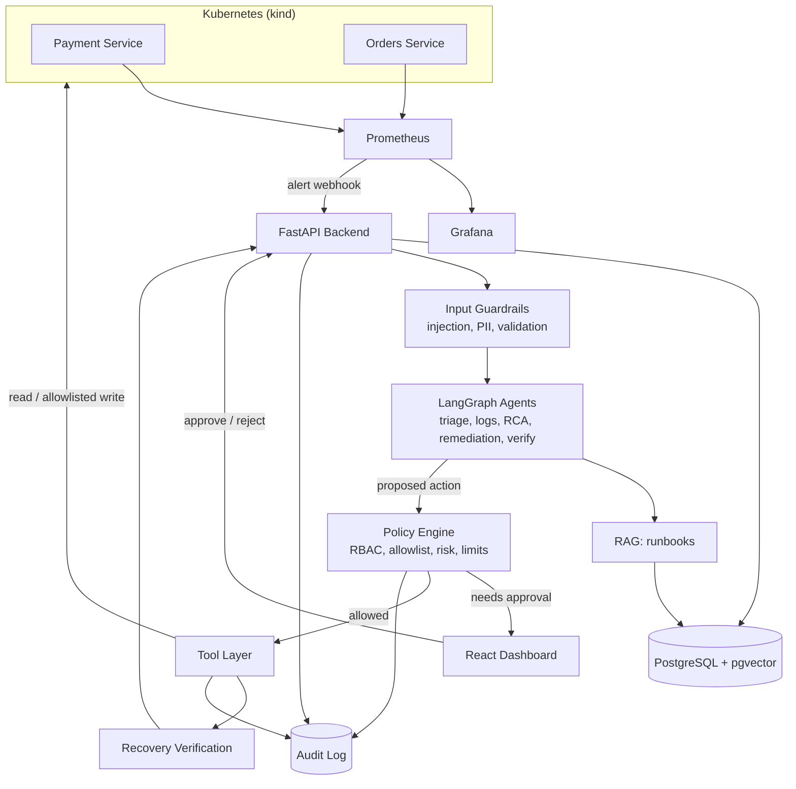

# OpsPilot AI — Architecture Diagram

```mermaid
flowchart TD
    subgraph K8s["Kubernetes (kind)"]
        S1[Payment Service]
        S2[Orders Service]
    end

    S1 --> P[Prometheus]
    S2 --> P
    P --> G[Grafana]
    P -->|alert webhook| API[FastAPI Backend]

    API --> DB[(PostgreSQL + pgvector)]
    API --> IG[Input Guardrails<br/>injection, PII, validation]
    IG --> LG[LangGraph Agents<br/>triage, logs, RCA, remediation, verify]
    LG --> RAG[RAG: runbooks]
    RAG --> DB

    LG -->|proposed action| PE[Policy Engine<br/>RBAC, allowlist, risk, limits]
    PE -->|needs approval| UI[React Dashboard]
    UI -->|approve / reject| API
    PE -->|allowed| TL[Tool Layer]
    TL -->|read / allowlisted write| K8s

    TL --> V[Recovery Verification]
    V --> API
    API --> AUD[(Audit Log)]
    PE --> AUD
    TL --> AUD
```
